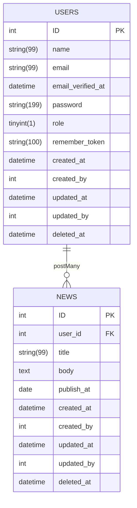

## Introduction 
- CMS manage blogs
- Most important in this project is working with AWS like EC2, S3, VPC, Cloudfront...

## Technology  
- Laravel 11 
- Docker
- CI/CD (Git Actions, Git hooks): 
    + Checking commit rules by Conventional Commits
    + Checking PHP scripts by PHPMD/PHDCS

## Database 

