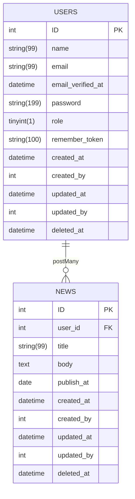

## Introduction 
- CMS manage blogs
- Most important in this project is working with AWS like EC2, S3, VPC, Cloudfront...

## Technology  
- Laravel 11 
    - Use **Laravel Breeze** (It is a minimal, simple implementation of all of Laravel's authentication features, including login, registration, password reset, email verification, and password confirmation)
        - Unit test use **Pest** framework (https://pestphp.com/)
- Docker
- CI/CD (Git Actions, Git hooks): 
    - Checking commit rules by Conventional Commits
    - Checking PHP scripts by PHPMD/PHDCS

## Architecture Diagram

```mermaid
architecture-beta
    %% User outside AWS Cloud
    service externalUser(cloud)[User]

    %% AWS Cloud
    group cloud(cloud)[Tokyo Region]
    service route53(logos:aws-route53)[Route 53] in cloud

    %% VPC Tokyo
    group vpcTokyo(logos:aws-vpc)[VPC Tokyo] in cloud
    service awsECS(logos:aws-ecs)[AWS ECS] in vpcTokyo

    %% AZ zone A
    group azZoneA(logos:aws-vpc)[AZ Zone A] in vpcTokyo

    %% Public subnet
    group publicSubnet(cloud)[Public Subnet] in azZoneA
    service alb(logos:aws-elb)[Application Load Balancer] in publicSubnet

    %% Private subnet
    group privateSubnet(cloud)[Private Subnet] in azZoneA
    group ec2Instance(logos:aws-ec2)[EC2 Instance] in privateSubnet
    service mordenizeNginx(logos:aws-elb)[Mordenize App] in privateSubnet

    %% Workflow
    externalUser:R --> L:route53
    route53:R --> L:alb
    alb:R --> L:awsECS
```

## Database Diagram

